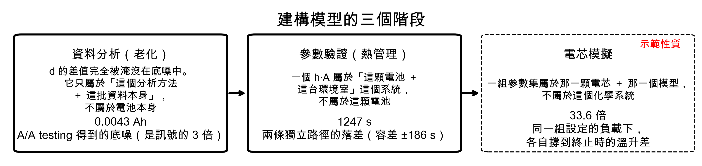
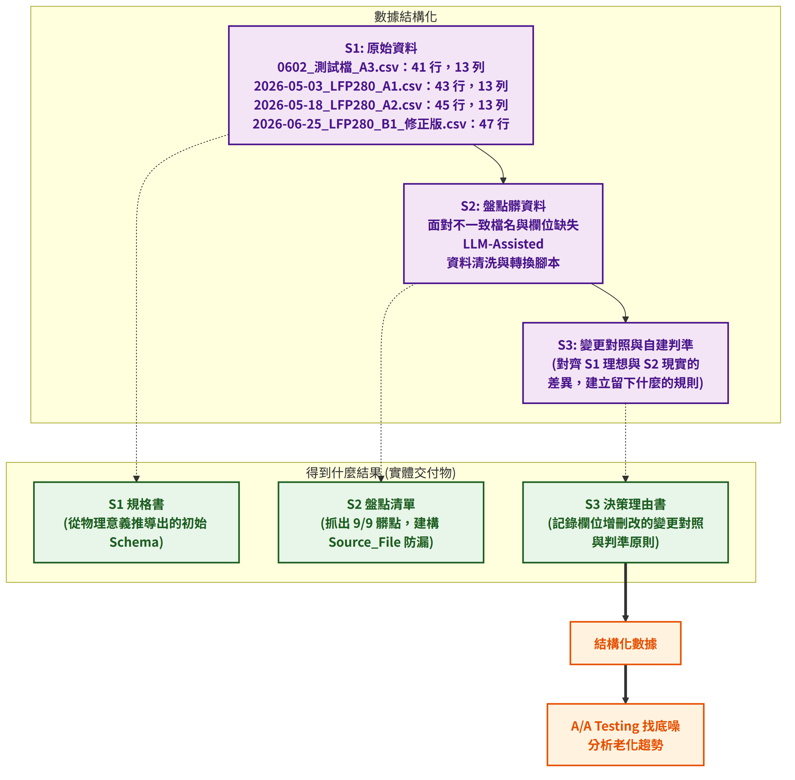
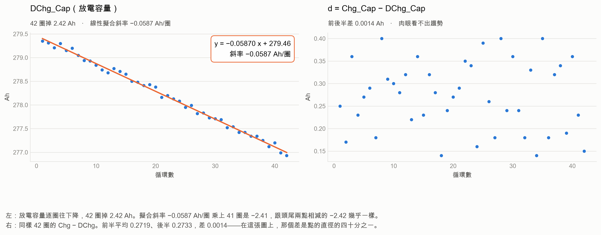
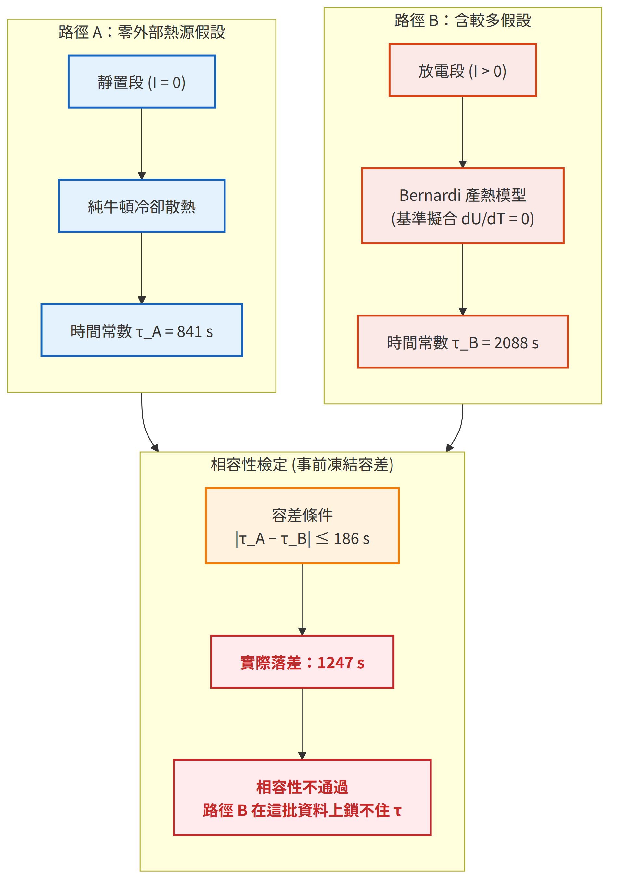
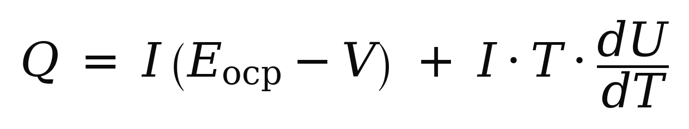
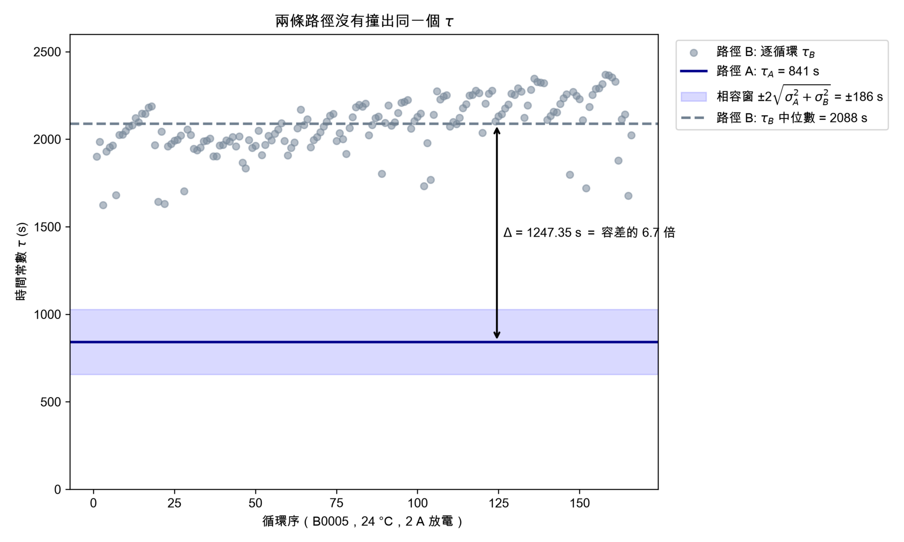
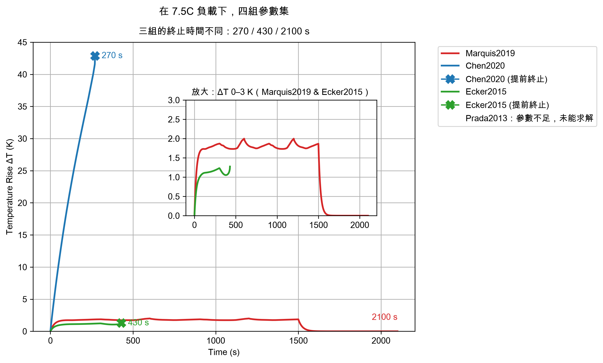
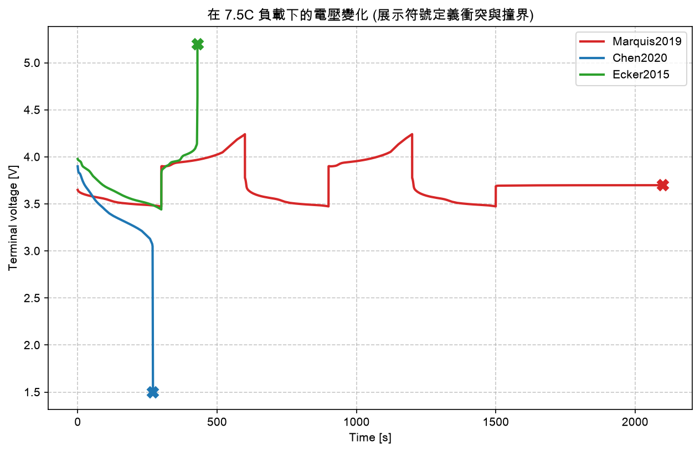
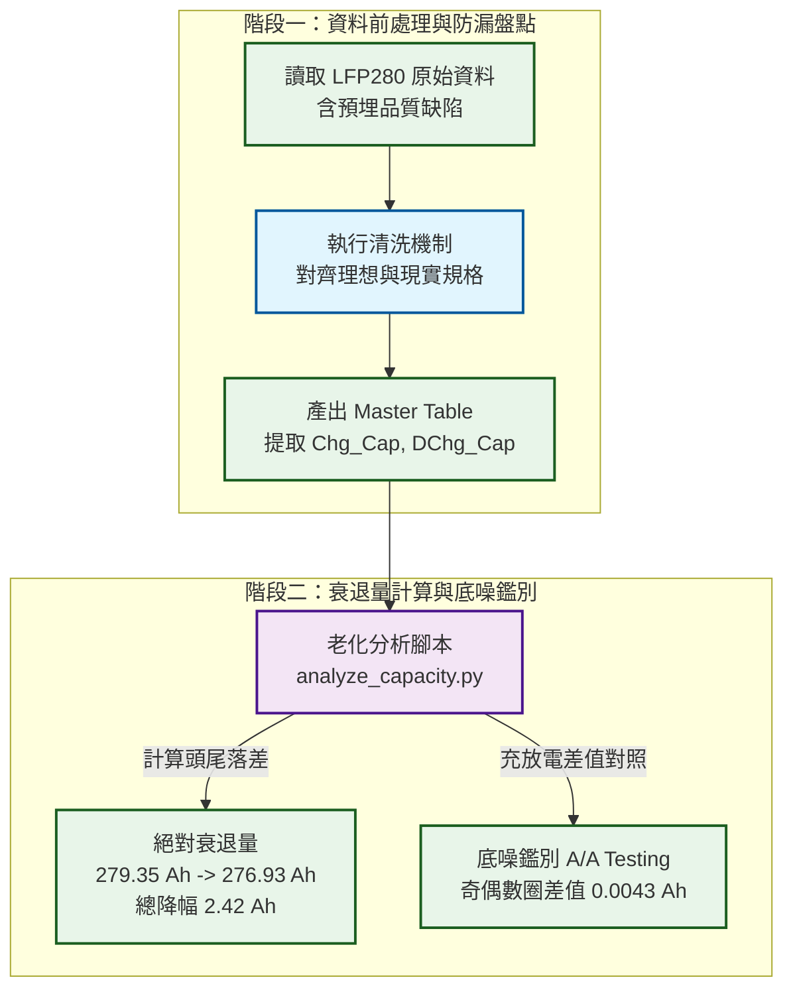
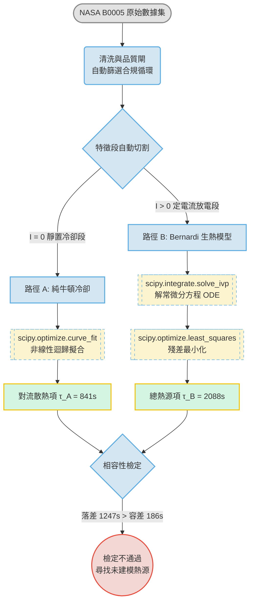

# AI 數據分析與產業應用實作

**以儲能電池數據為例——A/A Testing、獨立路徑對接與前置驗收標準**

張書瑋　／　20260901　／　wayne.mr.zhang@gmail.com

本報告的分析腳本與資料，就在這個 repo 裡。


## 目次

- **1　三個足以引導出錯誤結論的數據**

  *在資料、驗證與模擬三階段分別求出 0.0043 Ah、1247 秒、33.6 倍三個容易誤用的數字*

- **2　一個會跨階段傳遞的分析陷阱**

  *這三個階段沒有共用任何一個數字，卻容易犯相同模式的錯誤。*

- **3　資料分析：用 A/A Testing 破解一個不存在的趨勢**

  *我從資料裡讀出一個假趨勢，然後用一個設計好的「應該沒東西」的比較把它排除。*

- **4　參數驗證：兩條獨立物理路徑的邊界對接測試**

  *調整模型的參數可以讓曲線重合，卻讓本來應該得到相同結論的兩條獨立物理路徑差了 1247 秒。*

- **5　電芯模擬：PyBaMM 參數集的邊界壓力測試**

  *同一組負載設定、同一個模型，只換參數集，溫升差 33.6 倍，還有一組跑不起來。*

- **6　總結：四個可以用的檢查機制與犯錯紀錄**

  *關於數據分析的 AI 協作方式與我的實務心得*

- **7　附錄**


## 1　三個足以引導出錯誤結論的數據

*在資料、驗證與模擬三階段分別求出 0.0043 Ah、1247 秒、33.6 倍三個容易誤用的數字*

在架構數據分析模型時，業界常見的做法是：只要 R²（擬合度）夠高，就宣稱模型精準。**但這只說明模型在這批資料上貼得緊；它不告訴你反解出來的數字能不能用在別的地方。**
這份報告中得到的三個數字，若直接使用會導致錯誤的結論，所以我**設計了跨階段的獨立檢驗方法**，並釐清這三個數字到底扮演什麼角色。

### 三個容易誤用的數字

#### 1. 資料階段——0.0043 Ah

第三頁探討在 LFP280 的四十二個充放電循環資料中（註 1-2），我們很容易被微小的充放電容量差 d（註 1-1）的表面趨勢 **0.0014 Ah** 所誤導。然而，透過導入 A/A Testing 的交錯分組手法，我發現這批資料純粹的統計底噪高達 **0.0043 Ah**，是表面訊號的三倍。
→ **這說明 0.0014 Ah 的差值完全被淹沒在底噪中：它只能用在「這個分析方法 ＋ 這批資料本身」，不能直接給電池本身使用。**


#### 2. 驗證階段——1247 秒

第四頁我使用 SciPy 分析 **NASA B0005** 的公開實驗數據（註 1-3），分別用兩條假設量不同的獨立路徑，去算同一個散熱時間常數 τ。

- **路徑 A（靜置段擬合）**：無熱源下的純散熱。算出 τ 的基準 **841 s**。
- **路徑 B（放電段擬合）**：有熱源（產熱模型）下的散熱。算出的 τ 為 **2088 s**。

可發現**兩者相差 1247 s。而容差 ±186 s 是在看到路徑 B 的結果之前就決定的——落差是容差的 6.7 倍，相容性檢定不通過。**
→ 代表這個**時間常數 τ 所反映的散熱能力（h·A）**只能用在「這顆電池 ＋ 這台環境室 **＋ 這條假設路徑**」這個系統，不能用在這顆電池，**根本不能直接這樣算出『這顆電池的溫升極限』。**


#### 3. 模擬階段——33.6 倍

在相同負載設定、相同一個模型的情況下，只換 PyBaMM 內建參數集（註 1-4），**四組跑出四種結局**：一組跑完、兩組在不同時間撞到電壓上下限而終止、一組根本跑不起來。有解的三組之間，最大溫升差 **33.6 倍**——**而這三組各自撐到 270 / 430 / 2100 秒才停。**
→ 代表**這個數字只能用在「這個負載設定 ＋ 這三組參數 ＋ 各自的終止條件」**，根本不能直接當作熱管理設計的絕對依據；未經邊界對齊與參數校正的模擬數字，就只是一堆演算法的產物，絕不能視為這顆電池的物理真值。

### 附註與資料集出處

**註 1-1**：$d$ 為充放電容量差，$d = \mathrm{Chg\_Cap} - \mathrm{DChg\_Cap}$。這代表電池在該次循環中，充進去卻沒有放出來的部分，反映每一圈不可逆的實體容量流失（單位為 Ah），亦可寫為 $d = \mathrm{Chg\_Cap} \times (1 - CE)$。本批資料的庫倫效率（CE）平均為 99.90%。

**註 1-2**：為本次資料結構化演練設計的 LFP280 測試集（4 檔 172 圈），含預設資料品質缺陷，用以取得真值已知為零的對照組。本階段展示的是方法，不是實測結論。
**註 1-3**：NASA Ames Prognostics Center of Excellence (PCoE) Battery Data Set。取得途徑：Kaggle `nasa-battery-life-prediction-dataset-cleaning`（清理後版本）。本報告使用 **B0005、24 °C、2 A 放電，166 個通過品質閘的循環**。
**註 1-4**：PyBaMM 內建參數集四組（Marquis2019／Chen2020／Ecker2015／Prada2013）。


## 2　一個會跨階段傳遞的分析陷阱

*這三個階段沒有共用任何一個數字，卻容易犯相同模式的錯誤。*

本專案建構了資料、驗證與模擬三條獨立防守線：以 A/A Testing 找出資料底噪、獨立物理路徑互相驗證、並藉由不同數據集在 PyBaMM 中的模擬結果推翻一個看起來已經收斂的散熱參數，如下圖（Fig 1）所示：



雖然這三階段之間**沒有共用任何參數**，但在實際執行自動化數據管線與 AI 協作時，卻極易因為缺乏物理防呆機制，而誘發出**完全相同模式的系統性錯誤**。具體實例與解決方法如下：

1. **【第一階段：資料分析】**：對 raw data 執行資料結構化流程，並用 A/A Testing 求出分析方法的雜訊底噪，推翻一個假的老化衰退趨勢，證明分析結果要同時用在資料分析方法與資料本身，而非電池特性。
2. **【第二階段：參數驗證】**：導入 Bernardi 產熱模型，用兩條獨立路徑驗證散熱常數，發現有 1247 秒的落差，遠大於系統的容差（186 s），相容性檢定不通過，證明這個參數只能用在推導它的那條假設路徑，不能當成電池本身的屬性。
3. **【第三階段：電芯模擬】**：在相同負載下抽換 PyBaMM 內建參數集，結果是不同時間內的溫升預測差距高達 33.6 倍，證明模擬結果只能用在特定的底層參數集。


## 3　資料分析：用 A/A Testing 破解一個不存在的趨勢

*我從資料裡讀出一個假趨勢，然後用一個設計好的「應該沒東西」的比較把它排除。*

本頁原始資料為 LFP280 測試集共 4 檔 172 圈（四個原始 csv 見 [`aging/data/`](https://github.com/waynemrzhangBJ4/battery-data-analysis/tree/main/aging/data)），其中三檔是 0.33C、一檔（A2，44 圈）是 1.0C，且含預先埋設的資料品質缺陷。**本頁主要展示的是老化分析方法，不是結論。** 資料分析架構如下圖呈現：



其中，使用 AI 協作開發（LLM-Assisted）協助資料清洗，過程中由我定義邊界與判斷物理意義，AI 負責寫程式跟圖表，輔以 AI 資料處理防錯機制整理出格式化資料（註 3-1）。**以下只取其中 A1 這一檔（0.33C，42 圈）做老化分析**，可初步得到放電容量的四項結果：

1. **絕對衰退量**：在 42 圈的循環中，放電容量從 279.35 Ah 降到 276.93 Ah，總共掉了 **2.42 Ah**，如下左圖。
2. **線性衰退率**：我對這 42 點進行線性擬合，得出斜率為 **-0.0587 Ah/圈**。這代表這顆電池平均每跑一圈就固定損失 0.0587 Ah。
3. **穩定度與信賴區間**：如果把斜率 0.0587 乘上 41 圈，算出來是 2.41 Ah，跟頭尾相減的 2.42 Ah 幾乎完全吻合。這證明**這條衰減曲線極度平滑、雜訊極低**（不像右圖的庫倫效率），是一個高度可信的落後指標。
4. **SOH 壽命預測**：這顆 LFP-280 電芯的標稱容量是 280 Ah。業界定義 SOH 80%（224 Ah）為壽命終點（End of Life）。有了這個穩定的斜率，我就能「大膽預測」，在相同測試條件下，這顆電池大約在 **950 圈**（註 3-2）左右會壽終正寢。**但這個數字是把 42 圈的斜率外推 23 倍的結果，而且只適用於『這個線性擬合方法 ＋ 這 42 圈』，不是這顆電池。**



若進一步求充放電容量差 d，比較『前 21 圈』與『後 21 圈』的平均 $d$ 值，分別為 0.2719 Ah 與 0.2733 Ah，兩者相差 **0.0014 Ah**。這看起來像是一個隨老化擴大的趨勢訊號。然而，如果導入 **A/A Testing** 的概念，改為比較『奇數圈』與『偶數圈』的平均 $d$ 值，算出來分別為 0.2748 Ah 與 0.2705 Ah，差值高達 **0.0043 Ah**。這代表在這批資料中，哪怕只是交錯分組，純粹的統計擾動（底噪）就有 0.0043 Ah。結果可發現，**底噪竟然是訊號的 3 倍**（0.0042857 ÷ 0.0014286 等於精確的 3 倍），足以證明 d 無法用來作為領先指標。

**註 3-1**：計算架構流程圖，含**計算階段**（資料怎麼流動）、**計算節點**（每個步驟的處理邏輯），以及對應**呼叫的腳本**。

**註 3-2**：**SOH 80% 壽命終點預測計算式**

- **衰退目標值**：標稱容量 280 Ah 的 80% 為 224 Ah。需衰退的總容量為 280 - 224 = 56 Ah。
- **預測圈數**：以線性擬合衰退率（0.0587 Ah/圈）進行外推：`56 Ah ÷ 0.0587 (Ah/圈) ≈ 954 圈`。

因此推估大約在 950 圈左右達到壽命終點 (EOL)。


## 4　參數驗證：兩條獨立物理路徑的邊界對接測試

*調整模型的參數可以讓曲線重合，卻讓本來應該得到相同結論的兩條獨立物理路徑差了 1247 秒。*

對於電池的發熱，我嘗試用 Python 重現 COMSOL 的圓柱電池集總熱模型。當時我把等效內阻從 0.0001 Ω 改成 0.007 Ω，可以完全模擬 COMSOL 模擬結果。但那個 0.007 不是量測出來的，是調整出來的。在這裡我們示範使用 SciPy 分析 **NASA B0005** 的公開實驗數據。這是一顆 2 Ah 的實體電池，在 **24 °C 恆溫箱中以 2 A 定電流放電**（標稱 2 Ah，約 1C；此為 NASA 資料集的公開規格），本報告用其中 166 個通過品質閘的循環。我們試圖從這批真實的曲線中，用兩條不同的物理路徑，去倒推逼近同一個時間常數，路徑示意圖如下：



其中**路徑 A** 假設較少，我鎖定數據中斷電後（I = 0）熱源消失的區間(共十九圈)，利用 Python（Pandas、SciPy）構建了**自動化資料處理管線（Data Pipeline）**（詳見【附錄 S-5】），對原始數據進行萃取與清洗，並針對靜置冷卻段執行**非線性迴歸擬合（Non-linear curve fitting）**，求出基準時間常數 τ_A = 841 s。（參考【附錄 S-3】）

而在路徑 B 放電段，可以藉由 Bernardi 產熱模型與能量守恆方程式解出 τ_B：



**其中熵熱項的 dU/dT 在基準擬合中設為 0——因為這批資料量不到它。**考慮到放電段的非線性極強，我取 **τ_B 的中位數 = 2088 s** 作為代表。可發現 τ_A、τ_B 落差 1247 s，容差為 186 s（在看到路徑 B 的結果之前就決定），**落差是容差的 6.7 倍。相容性檢定不通過。**（參考【附錄 S-4】）



### 為什麼有 6.7 倍的差距

我系統性盤點電池熱實驗可能的「誤差來源」，從軟體到硬體找出四個可能原因：

1. **取樣視窗錯位（資料處理端）**：切資料的時間點有沒有精準對齊？
2. **Entropy Heat Profile（物理機理端）**：可逆熱（熵熱）隨 SOC 劇烈變化的特性是不是不能忽略？
3. **量測延遲（感測硬體端）**：測溫設備會不會本身有熱慣性而延遲量測？
4. **環境溫度飄移（邊界條件端）**：散熱公式極度依賴溫差，會不會是環境測試箱的溫度太飄，導致散熱的基準線不穩？

首先排除**取樣視窗錯位（資料處理端）**的問題。為了釐清是不是因為「切資料的時間段不對」才產生巨大誤差，我把整個**放電段**切成兩半，分別丟給產熱模型去擬合。如果只拿**放電前 600 秒**來算，模型解得乾乾淨淨：殘差只有 **0.042 K**，166 圈沒有一圈觸及參數界，而解出來的熱容 **44.6 J/K** 也落在 18650 電芯的典型量級（**我用的參考值是 42 J/K，那是文獻量級的參考值，不是這顆電池的實測規格——見註 4-1**）。（參考【附錄 S-6】）
但如果拿**放電 1000 秒之後**的資料來算，同一個模型直接崩潰——**熱容撞上界 150 J/K，而且 166 圈全部觸界。**這證明了：原本求出來的 2088 s 根本是一個「把對的與錯的平均在一起的假象」。模型在放電前期是對的，但走到某個時間點之後開始錯了。而隨著放電時間推進，電池裡唯一持續在劇烈改變的變數就是 **SOC（電池殘電量）**。
所以下一步我們來討論隨 SOC 變化的**可逆熱（熵熱）**。（參考【附錄 S-6】）

而若試著用熵熱來解釋這個落差時卻發現，這條方程式對未知參數過度敏感，導致它根本無法獨立鎖定散熱常數。當我在發熱項中代入一個振幅僅 ±0.3–0.5 mV/K 的未知函數，並讓演算法重新去擬合最佳的散熱常數時，解出來的 $\tau$ 竟然在 412 s 到 14900 s 之間震盪，這個範圍把 841 ± 186 整個包在裡面。也就是說：只要我挑一個合適的剖面，我就能讓這個檢定通過。**而那個剖面，正是這批資料量不到的東西。**這條方程式對未知參數過度敏感，**它在這批資料上鎖不住散熱常數**——除非有 OCV-T 實驗資料，否則加不加熵熱都一樣。（詳見【附錄 S-7】）

接著討論第三點**量測延遲**。我將原本的一階常微分方程擴充為二階並多加一個『延遲常數』，結果求出來 $\tau_{lag}$ 中位數僅 1.68 秒，比 841 秒的散熱時間常數小了將近三個數量級，**而且 166 圈沒有一圈觸及參數界**。結論就是這個延遲項對系統整體誤差沒有貢獻。（詳見【附錄 S-8】）

最後關於「環境溫度」對散熱的影響，我發現這批資料每次改變溫度的同時，放電電流也跟著改變了。這兩個變數呈現共線性，數學上根本分不開「到底是誰造成的」。因此還是要對源頭的實驗設計加以改良，這是資料的限制，不是分析的失敗。
**總結來說，這批資料的極限就在這裡：在缺乏 OCV-T 實驗數據的情況下，我在數學上無法為有熱源的電池擬合出唯一且獨立的熱參數。**
目前我求出來的 h·A 只能夠解釋「這顆電池 ＋ 這台環境室 **＋ 這條假設路徑** 」這個系統，不能說是這顆電池的特性。

> 計算過程中求出的容差 ±186 s 是在計算路徑 B 的結果之前就已經決定的，同樣也要納入判斷計算結果是否合理的標準。
**也就是說，若我無法求解資料上的熱參數，工程上最常見的捷徑就是：我直接去文獻裡『借』一組別人做好的參數集來跑模擬，但這也將導致更嚴重的問題。**


> **兩條路徑的實際數值對照**（來源：W1e_process.py、2026-08-25 結案交接）：
> 
> | | 路徑 A（靜置段） | 路徑 B（放電段） |
> |---|---|---|
> | **τ** | 841 s | 2088 s |
> | **m·Cp** | 42 J/K（文獻量級參考，見註 4-1） | 79.85 J/K（擬合結果） |
> | **h·A** | 0.0499 W/K | 0.0380 W/K |
> 
> h·A 差 24%，但 τ 差 148%——因為 m·Cp 也跟著動（路徑 B 擬合出幾乎兩倍的熱容量）。這印證了報告核心論點：h·A 與 m·Cp 在單集總模型裡高度耦合，換一條假設路徑兩個都會跑掉。

**註 4-1**：42 J/K 指的是**集總熱容 m·Cp**（單位 J/K），不是比熱容量（J/(g·K)）。文獻上 18650 電芯的熱容量測值分布相當寬——Zatta et al. (2024) 以雙節點熱模型對四款商用高功率 18650（Molicel P28A / P28B / P30B、Sony Murata VTC5D，質量 44–48 g）量得核心熱容 **Cc = 55.7–70.2 J/K**。**本專案擬合出的 44.6 J/K 低於該區間下緣**——量級相符，但偏低。此處取 42 J/K 僅作為量級對照的參考值，不是這顆電池的實測規格，也不參與任何定案數值的計算。
> Zatta, N.; De Cesaro, B.; Dal Cin, E.; Carraro, G.; Cristofoli, G.; Trovò, A.; Lazzaretto, A.; Guarnieri, M. "Holistic Testing and Characterization of Commercial 18650 Lithium-Ion Cells." *Batteries* **10**(7), 248 (2024). doi:10.3390/batteries10070248


## 5　電芯模擬：PyBaMM 參數集的邊界壓力測試

*同一組負載設定、同一個模型，只換參數集，溫升差 33.6 倍，還有一組跑不起來。*

前面說明從真實數據提取參數有多困難。接下來我們討論，若想直接去文獻參考其他現成的電池參數來跑模擬會發生什麼事。下圖用一個簡單具體的例子來說明。四組參數集跑的是**同一段 7.5C 連續充放電循環**——放電 300 s → 充電 300 s，重複兩輪，再放電 300 s 後靜置 600 s，**總長 2100 s**。模型與終止條件都相同，只換參數集，我們會得到四個不同的結果：

1. Marquis2019 跑完 2100 s（2.00 K）
2. **Chen2020 270 s 撞電壓下限**（42.87 K）
3. Ecker2015 430 s 撞上限（1.27 K）
4. **Prada2013 根本跑不起來**（缺 Negative current collector thickness）

其中 **Chen2020 與 Ecker2015 撞的是相反方向的電壓界**：這源自不同文獻對電流符號的定義不同——有些參數集定義放電為正，有些定義充電為正。同樣一道 7.5C 放電指令，對後者而言其實是在充電，電壓因此反向飆升。**這是盲目套用文獻參數最容易踩的坑。**

（詳見【附錄 S-9】）




### 我們可以得到下述四個結論

1. **一個參數集只適用於那一顆電芯**——同一負載、同一模型，溫升差 **33.6 倍**。
2. **電芯設計決定應用邊界**——7.5C × 5 Ah = **37.5 A** 打在能量型 21700 上，**270 秒內上升 43 度，然後撞電壓下限終止**。
3. **參數集是「為某個模型準備的一整份資料」**，不是一組數字（Prada2013 缺一個厚度就跑不起來）。
4. **而這 33.6 倍本身也只適用於「產生它的那一整套東西」**——我們可以用兩個層次解釋。**第一層：時間間隔不相同。** 三組實際各自跑了 **270 / 430 / 2100 秒**才終止，**長度不等**。所以 33.6 是「**各自撐到終止時的溫升比**」，**不是「同一段時間內的溫升比」**。**第二層：「相同負載」是相同的 C-rate，不是相同的安培數。** 四組參數集各自帶著自己的標稱容量——Marquis **0.68 Ah**、Chen **5.0 Ah**、Ecker **0.156 Ah**、Prada **2.3 Ah**。同樣下 7.5C，實際電流是 **5.1 / 37.5 / 1.17 / 17.25 A——差 32 倍**。**所以 33.6 的分子是一顆 5 Ah 的電池吃 37.5 A，分母是一顆 0.156 Ah 的電池吃 1.17 A。**

> **成熟度誠實標示**：這一頁是示範，不是驗證。不對「哪組參數比較準」下任何判決。三個階段裡這一個最淺，而我知道它淺在哪。




上面的名稱從 （同一組7.5C....） 改為 (_在_ _7.5C 負載下....)


## 6　總結：四個可以用的檢查機制與犯錯紀錄

*關於數據分析的 AI 協作方式與我的實務心得*

在架構「數據驅動模型」時會經過資料的清洗與結構化、參數的驗證、以及模擬三個階段，每一個階段都有可能發生一樣模式的錯誤，尤其在 AI 協作開發的年代，在處理資料的過程中往往錯得很完美看不出來。以下列出我在分析中會用到的四個檢查機制。

| # | 機制 | 具體動作 | 核心價值 |
| --- | ------------------------------------------ | ---------------------------------------------------------------------------------------------- | ----------------------------------------------- |
| 1   | **A/A Testing**<br>先測底噪，再談訊號               | 將本應完全相同的「奇數圈與偶數圈」強行相減，測出 **0.0043 Ah** 的系統底噪。                                                  | 拒絕被假趨勢欺騙。在宣稱發現任何「訊號」前，先證明它大於系統的「雜訊」。            |
| 2   | **兩條獨立路徑對接**<br>結果要能收斂一致                 | 放棄「調參數讓兩條線重疊」，改用**兩條假設量不同的獨立路徑**：**靜置段的純散熱（零產熱項）** 對上 **放電段的 Bernardi 產熱模型**，撞出 **1247 秒**的落差。 | 破除「曲線疊得上 = 模型正確」的迷思。真實世界的電池模型內含的性質不會變，必須滿足物理邊界約束。 |
| 3   | 先算出容許的誤差範圍，再看結果合不合理 | 根據硬體極限，事前將容差死鎖在 **±186 秒**。當落差高達 1247 秒時，承認檢定不通過。                                              | 避免「射箭畫靶」，在看到爛結果後自動幫數據找藉口、私自放寬驗收標準。           |
| 4   | 結論的盲點思考方式具體化<br>**→ 失效條件句型**                | 句型：「X 會讓我覺得 A，但它不會告訴我 B」——「看見上升的趨勢會讓我覺得電池在老化，但不會告訴我這其實只是底噪。」                                   | 讓自己在看見漂亮的數據時，不急著交出去，而是主動尋找數字背後的致命盲點。            |

### 我在建立自動化數據管線與 AI 協作時，親身踩過的三大抽象層陷阱，以及我為此建立的防呆機制

**1. 兩句話互相推翻**

- 我曾經在同一份文件裡寫過「100% 正確、驗證完全通過」，又在後面寫「條件缺失，比較無效」。
- 原因：分析流程一長，每個步驟都變成獨立的一題——尤其在 AI 協作時，前一步為了讓曲線疊合而調的參數，到了後一步已經沒人記得它描述的是同一顆電池。
- **如何預防**：全局常數鎖定**（註 6-1）** ＋ 事前登記。物理邊界條件一旦在第一步確認，就鎖成全域值，後續模組不得為了讓結果好看而私自竄改。


**2. 同一個數字連錯三次（33.6 倍）**

- 在處理大量數據時，物理條件（時間長短、電流大小）會被剝離，只剩「數字」。我拿著 270 秒的溫升去除以 430 秒的溫升，忘了兩個數字的前提不一樣。
- **如何預防**：建立 **「物理對等檢查」（註 6-2）**。在運算任何比值前，必須強制檢核分母的物理前提（時間區間、安培數）是否對等，不對等就不能直接相除。


**3. 同一個病，第四次（0.0043 Ah 的端點）**

- 這又叫「精度斷層（文本污染）」。我雖然訂了「由端點計算」的規則，但我卻把「為了讓人類閱讀而四捨五入的顯示值（0.275）」，手動餵給程式去算，導致誤差放大好幾倍。
- **如何預防**：實施**「端點絕對溯源 (Data Provenance)」**。徹底禁止「手鍵數字」與「拿著 AI 的文本數字算數學」。凡是算差值與倍數，強制規定由腳本直接去讀最源頭的原始 .csv 檔，杜絕中間環節的污染。

> 現代工程師最大的挑戰已經不是『把東西算出來』，而是『如何建立一套防呆機制，確保流經不同軟體與 AI 節點的數據，不失真、不斷層、不脫離物理現實』。

### 結論：建立 AI 協作的機制

回到第 1 頁的問題：「這個數字到底適用什麼東西？」經過資料層的清洗、驗證層的熱模型解算，以及工具層的參數模擬，我們看到了同一個陷阱在三個不同維度反覆重演：**如果缺乏嚴格的防禦機制，我們隨時可以靠著調參或依賴 AI，產出一個曲線完美貼合的「完美結論」，但它在物理上卻可能是毫無意義的。**

- 在資料層，若沒有「A/A Testing」，我們就會把 0.0043 的底噪誤認為是老化趨勢。
- 在驗證層，若沒有「事前凍結容差」，我們就會為了迎合答案而私自調整參數。
- 在模擬層，若沒有意識到「參數集不能亂套用」，我們就會把**能量型電芯的參數（如 Chen2020），誤套用在高功率的應用場景中**（導致模擬嚴重失真，270 秒就提早終止）。

這三個實例證明了：在高度依賴軟體與 AI 協作的現代工程中，**工程師最大的挑戰已經不再是「把東西算出來」，而是「建立一套協作與檢查機制」**。如我操作的 A/A Testing、兩條獨立路徑、事前計算容差，目的只有一個：**讓每一個數字都指得出它適用哪一套東西——而這件事，換一個人拿同一批資料重跑一次，會得到同一個答案。**
有些數字最後的答案是「這批資料算不出來」。**那也是一個結果，而且是別人可以拿去用的結果**——這樣就知道該補哪一個實驗。
我能帶進團隊的不是「算得比較準」， **是在還沒算準之前，說得出自己差在哪裡、以及要補哪一個量測。**

以上這些都可以驗證：本報告的分析腳本與老化線資料都在 [github.com/waynemrzhangBJ4/battery-data-analysis](https://github.com/waynemrzhangBJ4/battery-data-analysis)，可以自己跑一次。**跑不起來的部分我也寫在裡面**——熱線需要另外下載 NASA 資料集，其中一支腳本目前無法獨立執行，這些沒有藏起來，也沒有假裝它跑得起來。

**註 6-1**：此處鎖定的是比較基準 841 s 與容差的計算公式，不是擬合參數——`m·Cp` 與 `h·A` 全程自由。

**註 6-2**：具體做法為物理元資料綁定、運算前置斷言、強制歸一化。


## 7　附錄

### 附錄一：絕對衰退量與底噪鑑別 (老化分析計算過程)

本節針對主報告第三頁所提及之「絕對衰退量 (2.42 Ah)」與「底噪鑑別 (0.0043 Ah)」提供計算過程架構與重現路徑。

#### 計算階段與節點流向




### 附錄二：分析腳本清單

> **完整可執行版本全部在 [github.com/waynemrzhangBJ4/battery-data-analysis](https://github.com/waynemrzhangBJ4/battery-data-analysis)**，以下每一節都附直接連結。

#### 【附錄 S-1】老化線資料前處理與清洗腳本 (clean_s2_data.py)

> **可執行版本（111 行）**：[`aging/clean_s2_data.py`](https://github.com/waynemrzhangBJ4/battery-data-analysis/blob/main/aging/clean_s2_data.py)

- **腳本對應**：`clean_s2_data.py`
- **主要功能**：將四台設備匯出、格式互不一致的循環測試檔整併為單一 Master Table。處理三類資料缺陷：日期格式混用（「年月日」、斜線、未補零）、容量單位 mAh 與 Ah 混用、以及 `cell_id` 命名不一致。
- **驗證結論**：四檔共 172 圈全數通過清洗並寫入 `cleaned_master_cycle_data.csv`，老化分析取其中 A1 檔的 42 圈（0.33C）。**這批 LFP280 資料是為了演練清洗流程而自建的合成資料集，缺陷為預先埋設、真值已知為零**——它不是實測老化資料，不可作此用途。

```python
# 核心清洗邏輯節錄：
def parse_time(val):
    # 統一「2026年5月3日」「2026/05/03」「2026-5-3」等混用寫法
    val = val.replace("年", "-").replace("月", "-").replace("日", "")
    val = val.replace("/", "-")
    ...
    return f"{year}-{month}-{day} {hour}:{minute}:{second}"

# 單位防呆：部分設備以 mAh 匯出，超過 1000 即視為單位錯置並換算回 Ah
if chg_cap > 1000:
    chg_cap /= 1000.0
if dchg_cap > 1000:
    dchg_cap /= 1000.0
```

#### 【附錄 S-2】老化線統計底噪鑑別腳本 (analyze_capacity.py)

> **可執行版本（72 行）**：[`aging/analyze_capacity.py`](https://github.com/waynemrzhangBJ4/battery-data-analysis/blob/main/aging/analyze_capacity.py)

- **腳本對應**：`analyze_capacity.py`
- **主要功能**：讀取 A1 檔 42 圈資料，萃取每圈的充放電容量差 `d`，以線性迴歸求整體容量衰退斜率，並執行 A/A Testing——把奇數圈與偶數圈分成兩組相減。這兩組來自同一母體、預期無差異，量出來的差值即為系統的統計底噪。
- **驗證結論**：表面趨勢訊號 0.0014 Ah，A/A Testing 量到的底噪 0.0043 Ah，**底噪是訊號的 3 倍**，該趨勢不成立。腳本全程以全精度輸出、不對任何中間值四捨五入，避免顯示值回頭參與運算（見第 6 頁陷阱 3）。

```python
# A/A Testing 核心邏輯節錄：
# 將奇數圈與偶數圈分組，消除長期衰退趨勢，純粹萃取統計底噪
df_odd = df[df['Cycle'] % 2 != 0]
df_even = df[df['Cycle'] % 2 == 0]

mean_d_odd = df_odd['d_value'].mean()
mean_d_even = df_even['d_value'].mean()
noise_floor = abs(mean_d_odd - mean_d_even)

# 全程不做四捨五入——顯示值不得回頭參與運算
print(f"    統計底噪 (雜訊)：{noise_floor} Ah")
snr_ratio = noise_floor / trend_signal if trend_signal != 0 else float('inf')
```

#### 【附錄 S-3】靜置段擬合腳本（路徑 A：`W1d_process.py`）

- **功能**：讀取上游 `tau_by_cycle_v3.csv`，對長視窗子集分別做「T_amb 固定為 24 °C」與「T_amb 自由擬合」兩種非線性迴歸，交叉驗證後定案 τ_A。
- **樣本**：166 圈中靜置尾巴長度 ≥ 450 s 者共 **19 圈**（集中於 cycle 145–166）。
- **定案值**：τ_A = **841 s**。
- **產出**：`tamb_diagnostic.csv`、`report_A3_final.md`、`fig_A10_tamb_diagnostic.png`
- **已知限制**：本腳本目前**無法獨立執行**——它同時需要上游產物 `tau_by_cycle_v3.csv` 與 NASA 的原始逐循環 csv，而現行介面只有一個 `--data-dir`，指不到兩處。
- **完整程式碼（242 行）**：[`thermal/W1d_process.py`](https://github.com/waynemrzhangBJ4/battery-data-analysis/blob/main/thermal/W1d_process.py)

#### 【附錄 S-4】放電段解微積分腳本（路徑 B：`W2b_process.py`）

- **功能**：在放電段解 Bernardi 產熱模型的能量守恆常微分方程（固定步長 RK4），以 `least_squares` **同時擬合 `m·Cp` 與 `h·A` 兩個自由參數**，逐循環求 τ_B；並執行多起點收斂檢查、T_amb 掃描、dU/dT 敏感度分析與誤差預算彙總。
- **樣本**：**166 個**通過品質閘的循環。
- **定案值**：τ_B 中位數 = **2088.35 s**；相容性檢定 |841 − τ_B| = 1247.35 s，容差半寬 186.31 s，**判定不通過**。
- **產出**：`w2b_fit_by_cycle.csv`（166 列）、`w2b_verdict.md`、`w2b_sigma_budget.csv`、`w2b_compat_check.csv` 等
- **重現性**：2026-09-02 於另一組路徑設定下重跑，τ_B 中位數為 `2088.348942780246`，與 2026-08-25 的結果**差 0.0**。
- **完整程式碼（627 行）**：[`thermal/W2b_process.py`](https://github.com/waynemrzhangBJ4/battery-data-analysis/blob/main/thermal/W2b_process.py)

#### 【附錄 S-5】NASA B0005 自動化資料處理管線架構

> **可執行版本（管線說明）**：[`thermal/README.md`](https://github.com/waynemrzhangBJ4/battery-data-analysis/blob/main/thermal/README.md)

在軟體工程與數據科學中，「Data Pipeline」指的是「將原始數據（Raw Data）自動轉換為最終分析結果的標準化流水線」。針對 NASA B0005 的龐大時序資料（電壓、電流、溫度），我們建立了一套能批次處理的自動化管線，取代人工試算表分析：

1. **Ingestion (載入)**：自動吃進並解析 NASA 的原始 `.mat` 或 `.csv` 實驗數據檔。
2. **Cleaning & Gating (清洗與品質閘)**：剔除異常值，並自動篩選出合規的 166 個有效循環。
3. **Segmentation (切割)**：利用程式邏輯將資料自動切分為「放電段 (I > 0)」與「靜置段 (I = 0)」。
4. **Computation (運算)**：將靜置段送進非線性擬合器（路徑 A，純牛頓冷卻），並將放電段送進 ODE 解算器（路徑 B，Bernardi 生熱模型）。
5. **Output (產出)**：最終自動計算出 $\tau_A$ 與 $\tau_B$ 的結果與容差分佈，進行相容性檢定。

**管線流程與雙路徑衝撞架構圖：**



#### 【附錄 S-6】NASA B0005 取樣視窗錯位驗證腳本

> **可執行版本（599 行）**：[`thermal/W2c_process.py`](https://github.com/waynemrzhangBJ4/battery-data-analysis/blob/main/thermal/W2c_process.py)

- **腳本對應**：`W2c_process.py`
- **主要功能**：將同一個循環的放電區間切分為「前期（$\le 600$ 秒）」與「後期（$\ge 1000$ 秒）」，並分別代入 Bernardi 產熱模型進行擬合。
- **驗證結論**：證明集總熱模型在放電前期運作正常（解出合理熱容 44.6 J/K），但走到放電後期卻完全崩潰（熱容撞上邊界 150 J/K）。此結果為「未建模之可逆熱（熵熱）隨 SOC 變化導致誤差」提供了直接的數值證據。

```python
# 核心切割邏輯節錄：
for wname, mask in [('early', t_all - t_all[0] <= 600), ('late', t_all - t_all[0] >= 1000)]:
    # 對 early 與 late 區間分別進行非線性最佳化擬合，設定熱容上限為 150
    r1 = least_squares(res_d3, starts_d3[0], bounds=([5, 0.005, 1], [150, 0.5, 600]))

```

#### 【附錄 S-7】NASA B0005 熵熱敏感度分析腳本

> **可執行版本（627 行）**：[`thermal/W2b_process.py`](https://github.com/waynemrzhangBJ4/battery-data-analysis/blob/main/thermal/W2b_process.py)

- **腳本對應**：`W2b_process.py`
- **主要功能**：在路徑 B（Bernardi 產熱模型）的主擬合框架中，針對熵熱項的未知係數 `dU/dT` 進行敏感度測試。
- **驗證結論**：當人為代入振幅僅 $\pm 0.3 \dots 0.5$ mV/K 的未知函數時，重新擬合出的散熱常數 $\tau_B$ 發生了從 $412$ s 到 $14900$ s 的劇烈震盪。這從數學上證明了集總熱模型對未知可逆熱源極度敏感，在缺乏實測 OCV-T 數據的情況下，演算法根本無法在此資料集上鎖定正確的散熱常數，只要變換剖面就能使相容性檢定通過，實為「過度擬合」的假象。

```python
# 核心迴圈邏輯節錄：
dudt_sens = []
# 測試 dU/dT 在 -0.5 到 +0.5 mV/K 之間的極微小擾動
for dudt_val in [-0.5, -0.2, 0.0, 0.2, 0.5]:
    dudt_vk = dudt_val / 1000.0
    # 將擾動項代入 fit_cycle 重新擬合，並記錄最佳化後的 tau_B_median_s
    r = fit_cycle(uid_dis, d_df, c_df, i+1, dudt=dudt_vk, Tamb=T_AMB_BASE)

```

#### 【附錄 S-8】NASA B0005 雙節點量測延遲驗證腳本

> **可執行版本（599 行）**：[`thermal/W2c_process.py`](https://github.com/waynemrzhangBJ4/battery-data-analysis/blob/main/thermal/W2c_process.py)

- **腳本對應**：`W2c_process.py`
- **主要功能**：將原本的單節點（集總）熱模型擴充為雙節點系統，引入測溫探針與電池表面間的熱傳遞方程式，並賦予演算法尋找「延遲常數（$\tau_{lag}$）」的自由度。
- **驗證結論**：166 圈資料擬合出的 $\tau_{lag}$ 中位數僅有 1.68 秒，與高達 841 秒的主散熱常數相差將近三個數量級。更重要的是，沒有任何一圈撞上人為設定的參數下界（1.01 s），延遲項的量級遠小於主散熱常數，且未觸界，因此排除它作為主要誤差來源。

```python
# 核心雙節點微分方程節錄：
def solve_2node_model(t, T0, I_t, V_t, E_ocp_t, mCp, hA, tau_lag, Tamb):
    ...
    def derivs(t_val, Tl, Tm):
        ...
        Q_gen = i * (e - v)
        # Tl: 電池內部集總溫度, Tm: 感測器量測溫度
        dTl = (Q_gen - hA * (Tl - (Tamb + 273.15))) / mCp
        dTm = (Tl - Tm) / tau_lag  # 擴充的二階量測延遲項
        return dTl, dTm

```

#### 【附錄 S-9】NASA B0005 PyBaMM 參數集邊界壓力測試腳本

> **可執行版本（147 行）**：[`cell/W5_process.py`](https://github.com/waynemrzhangBJ4/battery-data-analysis/blob/main/cell/W5_process.py)

- **腳本對應**：`W5_process.py`
- **主要功能**：在同一個單粒子集總熱模型（`SPM, thermal="lumped"`）、同一個 7.5C 高倍率充放電循環的實驗條件下，僅抽換不同的公開文獻參數集（`Marquis2019`, `Chen2020`, `Ecker2015`, `Prada2013`）進行極限條件壓力測試。
- **驗證結論**：測試結果印證了盲目套用文獻參數的危險性。即便在數學方程式完全相同的前提下，只要電芯內部設計規格（如集電體厚度、導熱係數等）有細微不同，在高倍率操作下就會因為微小誤差被急遽放大，導致結果完全發散（溫升落差達數十倍）或是直接崩潰（撞擊電壓邊界或報錯）。這證明了從真實營運數據逆向還原專屬系統參數的不可取代性。

```python
# 參數集迭代核心邏輯節錄：
param_sets = ["Marquis2019", "Chen2020", "Ecker2015", "Prada2013"]

model = pybamm.lithium_ion.SPM(options={"thermal": "lumped"})
experiment = pybamm.Experiment(experiment_steps)

for p_name in param_sets:
    # 提取文獻參數並覆寫
    param = pybamm.ParameterValues(p_name)
    # 嘗試丟入模擬，若缺少必備參數（如 Prada2013）或撞界則觸發 Exception
    try:
        sim = pybamm.Simulation(model, experiment=experiment, parameter_values=param)
        sol = sim.solve()
    except Exception as e:
        # 捕捉並紀錄崩潰原因
        failures.append({"param_set": p_name, "error_type": type(e).__name__})

```
